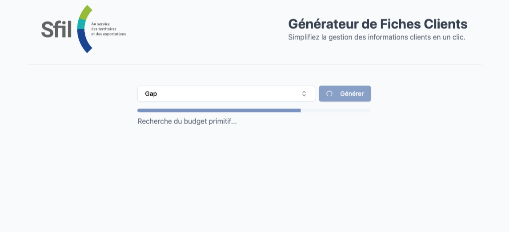
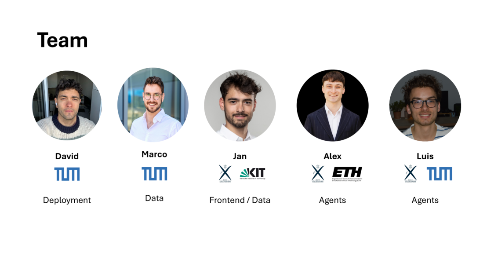

# h-genai

This project provides a comprehensive data collection and analysis system for French municipalities and their inter-municipal organizations (EPCIs). It combines financial data from the OFGL (Observatoire des Finances et de la Gestion publique Locales) API with AI-powered web research to create detailed municipality profiles.

<div align="center">
  
</div>

## Table of Contents
- [Key Features](#key-features)
  - [Financial Analysis](#financial-analysis)
  - [Data Sources](#data-sources)
  - [Architecture](#architecture)
  - [Output Formats](#output-formats)
- [Project Structure](#project-structure)
  - [Server](#server)
  - [Web Application](#web-application)
  - [Data](#data)
- [Developer Guide](#developer-guide)
  - [Prerequisites](#prerequisites)
  - [Local Development Setup](#local-development-setup)
  - [Building for Production](#building-for-production)
- [Useful Commands](#useful-commands)
- [CI/CD Pipeline](#cicd-pipeline)
  - [Workflow Overview](#workflow-overview)
  - [Environment Variables](#environment-variables)
- [Testing](#testing)
  - [Server Tests](#server-tests)
  - [Web App Tests](#web-app-tests)
  - [Adding New Tests](#adding-new-tests)
- [Team](#team)

## Key Features

### Financial Analysis
Detailed financial metrics for both municipalities and EPCIs including:
  - Budget analysis and debt metrics
  - Savings ratios and operating costs
  - Per capita financial indicators
  - Comparative analysis with similar municipalities

### Data Sources
- OFGL API for official financial data (https://www.ofgl.fr/)
- Perplexity API for web research (https://www.perplexity.ai/)
- RAG (Retrieval Augmented Generation) for document analysis
- Custom reference database of similar municipalities

### Architecture
- Backend: FastAPI server with AI agent system
- Frontend: Vue.js web application
- AI: Claude 3.5 Sonnet (via Amazon Bedrock) as the main LLM
- Database: DynamoDB for data persistence

### Output Formats
- Structured JSON data
- PDF reports
- Interactive web interface
- Comparative visualizations

The system is designed to help financial analysts, municipal administrators, and researchers access and analyze comprehensive 
municipal data through an intuitive interface while leveraging AI to enrich the data with contextual information.

## Project Structure

The project is organized into two main components:

### Server
- `agent/` (/server/agent): Core AI agent system
  - `agents.py` (/server/agent/agents.py): Agent implementations
  - `orchestrator.py` (/server/agent/orchestrator.py): Coordination of data collection
  - `tools.py` (/server/agent/tools.py): Tool implementations for agents
  - `prompt.py` (/server/agent/prompt.py): LLM prompt templates
  - `rag_pipeline.py` (/server/agent/rag_pipeline.py): Document retrieval system
  - `util.py` (/server/agent/util.py): Utility functions for querying the OFGL API
- `api/` (/server/api): FastAPI server implementation
- `template/` (/server/template): PDF report templates
- `tests/` (/server/tests): Test suite
- `notebooks/` (/server/notebooks): Development and testing notebooks

### Web Application
- `src/` (/web-app/src): Source code
  - `components/` (/web-app/src/components): Vue.js components
  - `stores/` (/web-app/src/stores): State management
  - `assets/` (/web-app/src/assets): Static assets
  - `lib/` (/web-app/src/lib): Utility functions
- `public/` (/web-app/public): Static files

### Data
- Notebooks and scripts for data preprocessing and exploration:
  - `explore_ofgl_api.ipynb` (/data/explore_ofgl_api.ipynb): Exploration of the OFGL API endpoints and available datasets
  - `pp_ofgl_data.ipynb` (/data/pp_ofgl_data.ipynb): Data preprocessing pipeline for municipality data including:
    - Deduplication of municipality entries
    - Population data normalization
    - Reference municipality selection
    - JSON data structure formatting

- Processed Data Files:
  - `populations-ofgl-communes-postprocessed.json`: Processed municipality dataset containing:
    - Basic municipality info (SIREN, codes, names)
    - Administrative hierarchy (commune, EPCI, department, region)
    - Population metrics (current and projected)
    - Reference municipalities for comparisons
    - Structured for easy API consumption

The data processing workflow:
1. Fetches raw data from OFGL API (https://data.ofgl.fr/api/explore/v2.1/)
2. Removes duplicate entries keeping most recent data
3. Adds reference municipalities based on:
   - Same region
   - Similar population size
   - Administrative status
4. Outputs standardized JSON format for the application

## Developer Guide

### Prerequisites
- Python 3.11+
- Node.js 18+
- Docker
- AWS Account with Bedrock access
- API keys for Perplexity and OFGL

### Local Development Setup

1. Clone the repository
2. Set up environment variables in `.env` files for both server and web-app
3. Install dependencies:
   - Server: `poetry install`
   - Web-app: `npm install`
4. Start development servers:
   - Server: `poetry run uvicorn main:app --reload`
   - Web-app: `npm run dev`

### Building for Production
- Server: `docker build -t h-genai-server .`
- Web-app: `npm run build`

## Useful commands

### Deploying changes to AWS Lambda
Sample command:
```bash
cd server && docker build -t h-genai-server . && docker tag h-genai-server:latest 140023381458.dkr.ecr.us-west-2.amazonaws.com/
h-genai-server:latest && docker push 140023381458.dkr.ecr.us-west-2.amazonaws.com/h-genai-server:latest && aws lambda 
update-function-code --function-name h-genai-server --image-uri 140023381458.dkr.ecr.us-west-2.amazonaws.com/h-genai-server:latest
```
## CI/CD Pipeline
The project uses GitHub Actions for continuous integration and deployment, configured in `.github/workflows/aws-deployment.yml`.
### Workflow Overview
The pipeline consists of three main jobs:
1. **Test Server**:
   - Runs on every push to `main` that changes files in `/server`
   - Sets up Python 3.11 environment
   - Installs dependencies using Poetry
   - Runs pytest suite
   - Caches dependencies for faster builds
2. **Deploy Server** (runs after successful tests):
   - Builds Docker image for Lambda deployment
   - Pushes to Amazon ECR
   - Updates Lambda function
   - Configures provisioned concurrency
   - Creates production alias
3. **Deploy Web App** (on `web-app` branch):
   - Sets up Node.js environment
   - Runs tests and builds application
   - Deploys to AWS Amplify
### Environment Variables
Required secrets in GitHub:
```bash
AWS_ACCESS_KEY_ID
AWS_SECRET_ACCESS_KEY
AWS_ECR_REGISTRY
AWS_AMPLIFY_APP_ID
```

## Testing

### Server Tests

The server component uses pytest for testing. Tests are located in `/server/tests/`.

1. **Unit Tests**:
```bash
cd server
poetry run pytest
```

2. **Local Lambda Testing**:
```bash
# Build and run container
docker build -t h-genai-server:local .
docker run -p 8080:8080 h-genai-server:local

# Test endpoints
curl -X POST "http://localhost:8080/2015-03-31/functions/function/invocations" \
  -H "Content-Type: application/json" \
  -d '{
    "version": "2.0",
    "routeKey": "GET /health",
    "rawPath": "/health",
    "requestContext": {
      "http": {
        "method": "GET",
        "path": "/health"
      }
    }
  }'
```

3. **Integration Tests**:
- Test script available at `test_local.sh`
- Automates container lifecycle and endpoint testing
- Provides detailed test results

### Web App Tests

The web application uses Vitest for testing:

```bash
cd web-app
npm run test
```

### Adding New Tests

1. **Server Tests**:
   - Add test files in `/server/tests/`
   - Follow existing patterns for API and agent tests
   - Use pytest fixtures from `conftest.py`

2. **Web App Tests**:
   - Add test files alongside components
   - Use Vue Test Utils for component testing
   - Follow Vue's testing best practices

## Team

<div align="center">
  
